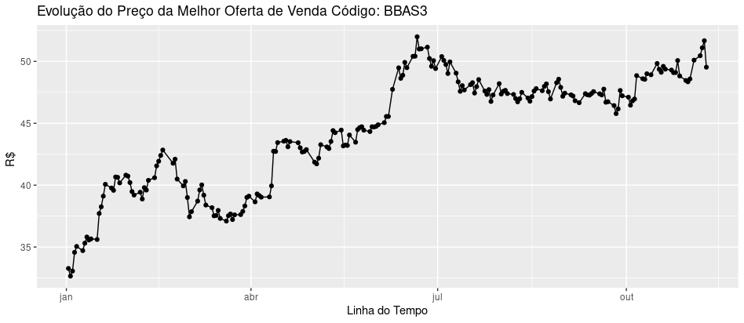
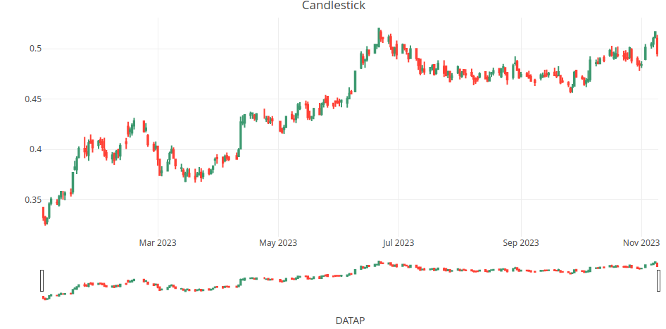

# AÇÕES B3
Análise das Séries Históricas das Ações da B3

Script em Linguagem R para análise dos dados das ações das empresas listadas na B3

Os arquivos de dados podem ser acessados diretamente no site da B3 por meio do endereço:
https://www.b3.com.br/pt_br/market-data-e-indices/servicos-de-dados/market-data/historico/mercado-a-vista/series-historicas/

Os arquivos estão no formado txt com largura fixa.

Para processamento dos arquivos foi utilizada a função read.fwf do pacote utils do R.
Foram também utilizadas as bibliotecas dplyr, gdata e ggplot2

O layout do arquivo pode ser acessado por meio do link:
https://www.b3.com.br/data/files/33/67/B9/50/D84057102C784E47AC094EA8/SeriesHistoricas_Layout.pdf

Exemplo Gráfico de Linhas:

Exemplo Gráfico Candlestick

Exemplo Gráfico Decomposição

